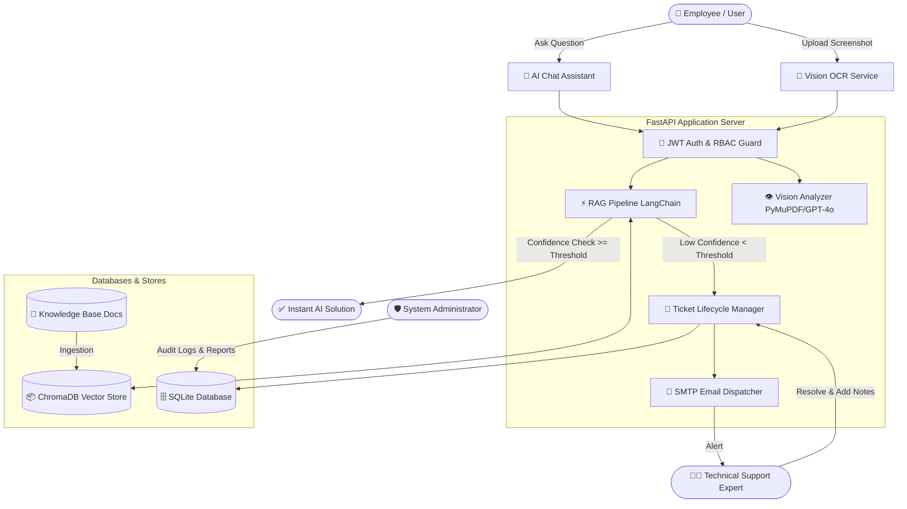

# 🏢 Enterprise AI Support Assistant (SAP / ERP Intelligent Copilot)

[](https://fastapi.tiangolo.com/)
[](https://reactjs.org/)
[](https://www.typescriptlang.org/)
[](https://www.langchain.com/)
[](https://tailwindcss.com/)
[](https://vitejs.dev/)
[](https://sqlite.org/)
[](LICENSE)

An enterprise-grade, **Role-Based AI Support Ecosystem** designed to automate Tier-1 and Tier-2 IT/SAP support issues (FI/CO, MM, SD, ABAP, Basis). Powered by **Retrieval-Augmented Generation (RAG)**, **Multimodal Vision OCR**, **Automated SLA Ticketing**, and **Real-time SMTP Email Alerts**.

---

## 📸 Visual Showcase & Screenshots

> _Replace the placeholder images below with your actual application screenshots._

### 1. Landing Page & Product Overview
<!-- SCREENSHOT PLACEHOLDER: Landing Page -->
```markdown

```
*Modern glassmorphic landing page featuring real-time system metrics, module breakdown, and quick access.*

---

### 2. Employee AI Chat (RAG Knowledge Retrieval)
<!-- SCREENSHOT PLACEHOLDER: AI Chat -->
```markdown

```
*Context-aware AI Copilot providing step-by-step troubleshooting with citation sources and confidence score meters.*

---

### 3. Vision OCR Error Analysis Studio
<!-- SCREENSHOT PLACEHOLDER: OCR Studio -->
```markdown

```
*Multimodal Vision OCR extracting text from SAP GUI screenshots, identifying error codes, and recommending instant fixes.*

---

### 4. Employee Support Ticket Management
<!-- SCREENSHOT PLACEHOLDER: Tickets -->
```markdown

```
*Automated and manual ticket tracking with real-time status changes, priority tagging, and expert notes.*

---

### 5. Dedicated Technical Expert Workspace
<!-- SCREENSHOT PLACEHOLDER: Expert Dashboard -->
```markdown

```
*Technical support view for resolving escalated tickets, submitting resolution summaries, and managing team queues.*

---

### 6. Admin Analytics, Audit Reports & Configuration
<!-- SCREENSHOT PLACEHOLDER: Admin Analytics -->
```markdown

```
*Executive KPIs, resolution rates, module distributions, downloadable CSV/PDF audit reports, and AI confidence thresholds.*

---

## 🌟 Key Features

### 1. 🧠 Intelligent RAG Support Assistant
- **Vector Retrieval**: Embeds and indexes enterprise SOPs, policies, and SAP guides in ChromaDB.
- **Dual LLM Provider**: Supports high-performance free **Groq (Llama-3.3-70b)** or **OpenAI (GPT-4o / GPT-3.5-turbo)**.
- **Confidence Scoring & Auto-Escalation**: Analyzes vector distance scores. If query confidence is below the threshold, the system automatically creates a support ticket for human experts.

### 2. 📸 Multimodal Vision OCR Diagnostic Engine
- **Error Screenshot Parsing**: Automatically extracts error text, identifies SAP modules (FI, MM, SD, Basis), and pinpoints root causes from images or multi-page PDFs using PyMuPDF and GPT-4o Vision.
- **Instant Resolution Guides**: Converts raw error logs into actionable, step-by-step resolutions.

### 3. 👥 3-Tier Role-Based Access Control (RBAC)
- **Employee Workspace**: Access AI Chat, Vision OCR, Personal Tickets, In-App Notifications, and Searchable Knowledge Base.
- **Support Expert Workspace**: Dedicated dashboard to accept, review, add resolution notes, and close escalated tickets.
- **Administrator Panel**: Monitor system health, user status, download audit logs/reports, and adjust global LLM confidence thresholds.

### 4. 📧 Automated SMTP Email Notification Engine
- Dispatches automated HTML emails via Gmail SMTP when:
  - A support ticket is created or auto-escalated by AI.
  - An expert updates ticket status or attaches resolution notes.
  - A ticket is successfully resolved.

### 5. 📊 Executive Analytics & Exportable Reports
- Real-time resolution metrics, category distributions, priority breakdowns, and SLA response rates.
- One-click export of system audit logs and ticket history in **CSV** and **PDF** formats.

---

## 🏗️ System Architecture & Workflow



---

## 🛠️ Technology Stack

| Layer | Technologies |
| :--- | :--- |
| **Frontend** | React 18, TypeScript, Vite, Tailwind CSS, Radix UI / Shadcn, Lucide React, Recharts |
| **Backend** | Python 3.10+, FastAPI, Uvicorn, Pydantic, PyMuPDF (fitz) |
| **AI / RAG** | LangChain, ChromaDB, Groq API (Llama-3.3-70b), OpenAI (GPT-4o / Text-Embedding-3-Small) |
| **Database** | SQLite (Production ready for PostgreSQL / SQLAlchemy) |
| **Security** | JWT (JSON Web Tokens), BCrypt Password Hashing, Role-Based Route Guards |
| **Notifications** | Python `smtplib` (Gmail SSL / TLS), In-App Real-time Notification Feed |

---

## 📁 Repository Structure

```plaintext
Enterprise-ai-support-assistant/
├── documents/                  # Enterprise documents & SOPs for RAG ingestion
│   └── it_policy.txt
├── frontend/                   # React + TypeScript + Tailwind CSS Frontend
│   ├── src/
│   │   ├── components/         # Reusable UI components & Radix primitives
│   │   ├── layouts/            # Multi-Role Layouts (Dashboard, Admin, Expert)
│   │   ├── lib/                # API client & utilities
│   │   ├── pages/
│   │   │   ├── admin/          # Admin Panel, Analytics, Reports, Notifications
│   │   │   ├── employee/       # AI Chat, OCR Scanner, Notifications
│   │   │   ├── expert/         # Expert Queue, Resolution Studio
│   │   │   └── shared/         # Home, Login, Register, Knowledge Base, Tickets
│   │   ├── App.tsx             # Protected Routing & Role Guards
│   │   └── main.tsx
│   ├── package.json
│   └── vite.config.ts
├── uploads/                    # Dynamic user uploads (OCR images, KB attachments)
│   └── kb/
├── .env.example                # Example configuration template
├── .gitignore                  # Industry-standard git ignore file
├── config.py                   # Global system constants & model hyperparameters
├── database.py                 # SQLite database schema, connections & queries
├── ingest.py                   # Document chunking & ChromaDB embedding script
├── ocr_service.py              # Vision OCR & PDF extraction service
├── rag_pipeline.py             # LangChain RAG pipeline & confidence scoring
├── requirements.txt            # Python backend dependencies
├── server.py                   # FastAPI application server & REST endpoints
└── README.md                   # Project documentation
```

---

## 🚀 Getting Started

### Prerequisites

- **Python**: Version 3.10 or higher installed.
- **Node.js**: Version 18.x or higher and `npm` installed.
- **API Keys**: A free [Groq API Key](https://console.groq.com/) or [OpenAI API Key](https://platform.openai.com/).

---

### Step 1: Clone the Repository

```bash
git clone https://github.com/YOUR_USERNAME/Enterprise-ai-support-assistant.git
cd Enterprise-ai-support-assistant
```

---

### Step 2: Backend Setup (FastAPI & Python)

1. **Create and activate a virtual environment**:
   ```bash
   # Windows (PowerShell)
   python -m venv .venv
   .venv\Scripts\Activate.ps1

   # Linux / macOS
   python3 -m venv .venv
   source .venv/bin/activate
   ```

2. **Install Python dependencies**:
   ```bash
   pip install -r requirements.txt
   ```

3. **Configure Environment Variables**:
   Create a `.env` file from the `.env.example` template:
   ```bash
   cp .env.example .env
   ```

   Open `.env` and fill in your keys:
   ```env
   # LLM API Keys
   GROQ_API_KEY=gsk_your_groq_api_key_here
   OPENAI_API_KEY=sk-your_openai_api_key_here

   # Database & Authentication
   DATABASE_URL=sqlite:///database.db
   JWT_SECRET_KEY=enterprise-ai-support-jwt-secret-key-2026-ffc

   # Email Configuration (Optional - Gmail App Password)
   SMTP_EMAIL=your_email@gmail.com
   SMTP_PASSWORD=your_16_character_app_password
   ```

4. **Ingest Documents into Vector Store**:
   ```bash
   python ingest.py
   ```

5. **Start the FastAPI Backend Server**:
   ```bash
   python server.py
   ```
   *The backend API will run at `http://localhost:8000` (API Docs at `http://localhost:8000/docs`).*

---

### Step 3: Frontend Setup (React + Vite)

1. **Navigate to the frontend directory**:
   ```bash
   cd frontend
   ```

2. **Install Node dependencies**:
   ```bash
   npm install
   ```

3. **Start the Vite development server**:
   ```bash
   npm run dev
   ```
   *The frontend application will be live at `http://localhost:5173`.*

---

## 🔑 Default Demo Accounts

Use these pre-configured credentials to explore the different role views:

| Role | Email | Password | Access Area |
| :--- | :--- | :--- | :--- |
| **🛡️ Administrator** | `admin@company.com` | `admin123` | `/admin/login` -> `/admin` |
| **👨‍💻 Support Expert** | `expert@company.com` | `expert123` | `/login` -> `/expert/dashboard` |
| **👤 Employee** | `employee@company.com` | `employee123` | `/login` -> `/dashboard` |

> *New accounts can also be created anytime using the `/register` page.*

---

## 📡 REST API Reference

| Method | Endpoint | Description | Auth Required |
| :--- | :--- | :--- | :---: |
| `POST` | `/api/auth/login` | Authenticate user & return JWT token | No |
| `POST` | `/api/auth/register` | Register new employee / expert account | No |
| `POST` | `/api/chat` | Query RAG pipeline for context-aware answer | Yes |
| `POST` | `/api/ocr` | Upload error image/PDF for Vision analysis | Yes |
| `GET` | `/api/tickets` | Retrieve tickets (filtered by user role) | Yes |
| `POST` | `/api/tickets` | Create a new manual support ticket | Yes |
| `PATCH` | `/api/tickets/{id}/status` | Update status (`In Progress`, `Resolved`) | Yes (Expert/Admin) |
| `GET` | `/api/admin/analytics` | Fetch resolution rates & category metrics | Yes (Admin) |
| `GET` | `/api/admin/audit-logs` | Fetch system audit trails | Yes (Admin) |
| `GET` | `/api/notifications` | Fetch unread notifications for active user | Yes |
| `GET` | `/api/kb/search` | Full-text and semantic knowledge base search | Yes |

---

## 🌐 Live Production Deployment Guide

### Option 1: Railway.app (FastAPI Backend) + Vercel (React Frontend)

#### 1. Deploy Backend on [Railway.app](https://railway.app)
1. Sign in to **Railway.app** using your GitHub account.
2. Click **New Project** -> **Deploy from GitHub repo**.
3. Select your repository (`-Enterprise-AI-Support-Assistant`).
4. Click **Add Variables** and configure:
   - `GROQ_API_KEY`: Your Groq Key
   - `OPENAI_API_KEY`: Your OpenAI Key
   - `JWT_SECRET_KEY`: Your JWT Secret
   - `SMTP_EMAIL`: Your Gmail Address
   - `SMTP_PASSWORD`: Your Gmail App Password
5. Under **Settings** -> **Networking**, click **Generate Domain**.
6. Railway will automatically build using `Procfile` and give you a public URL (e.g., `https://enterprise-ai-support-backend.up.railway.app`).

#### 2. Deploy Frontend on [Vercel.com](https://vercel.com)
1. Import GitHub repository on Vercel.
2. Set Root Directory to `frontend`.
3. Add Environment Variable `VITE_API_BASE_URL` = `https://enterprise-ai-support-backend.up.railway.app` (Your Railway Backend URL).
4. Click **Deploy**.

---

### Option 2: Koyeb.com (100% Free Forever Alternative for Backend)
1. Sign up on [Koyeb.com](https://www.koyeb.com/).
2. Create a **New App** -> **GitHub**.
3. Set Build Command: `pip install -r requirements.txt && python ingest.py`
4. Set Run Command: `python server.py`
5. Add environment variables and deploy.

---

## 🛡️ Security Best Practices

- **Zero-Secret Commits**: All sensitive credentials, API keys, database files, and uploaded files are excluded from Git via `.gitignore`.
- **JWT Authentication**: Role-scoped tokens with automatic expiration and secure client-side storage.
- **BCrypt Encryption**: All user passwords stored in SQLite are cryptographically hashed using salted BCrypt.

---

## 🤝 Contributing

Contributions, issues, and feature requests are welcome!
1. Fork the Project.
2. Create your Feature Branch (`git checkout -b feature/AmazingFeature`).
3. Commit your Changes (`git commit -m 'Add some AmazingFeature'`).
4. Push to the Branch (`git push origin feature/AmazingFeature`).
5. Open a Pull Request.

---

## 📄 License

Distributed under the **MIT License**. See `LICENSE` for more information.

---

<p align="center">
  Built with ❤️ for Modern Enterprise Support & Intelligent Automation
</p>
